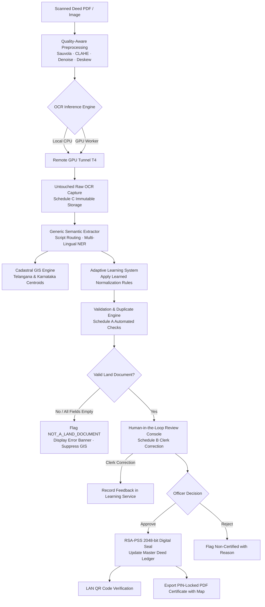

# OneBhoomi (వన్‌భూమి / वनभूमि) 🏛️📜

**Air-Gapped Multilingual Land Record Digitization, Cadastral GIS Grounding, Adaptive Learning & RSA-PSS Cryptographic Sealing System**

[](https://www.python.org/)
[]()
[](https://github.com/PaddlePaddle/PaddleOCR)
[](https://cryptography.io/)
[]()
[-brightgreen.svg)]()

OneBhoomi is a production-grade, offline-first intelligent land records digitization and validation platform engineered for Indian sub-registrar offices, revenue departments, and land administration authorities. Aligned with the **Digital India Land Records Modernization Programme (DILRMP)** and Land Records Management Systems (LRMS), OneBhoomi extracts structured legal facts from historical deeds, validates land parcels against cadastral GIS datasets, detects duplicate registrations and invalid files, enables human-in-the-loop clerk review, learns continuously from human corrections, and cryptographically seals verified deeds with **RSA-PSS 2048-bit** digital signatures.

---

## 🌟 Core System Pillars

### 1. Multilingual OCR & Multi-Script Recognition
- Native recognition across **7 major Indian languages**: **English (`en`)**, **Telugu (`te`)**, **Hindi (`hi`)**, **Kannada (`kn`)**, **Tamil (`ta`)**, **Marathi (`mr`)**, and **Urdu (`ur`)**.
- **Unicode-Based Script Routing**: Employs character-range Unicode analysis ([`detect_script_and_language()`](file:///land_document_extractor.py)) to identify Telugu, Devanagari, Kannada, Tamil, Perso-Arabic, and Latin scripts on a per-line basis, eliminating English keyword bias.
- **Dual-Engine Execution**: Supports local CPU PaddleOCR inference directly on air-gapped workstations or remote GPU hardware (Kaggle/Colab T4 x2) via automated tunnels.

### 2. Quality-Aware Adaptive Image Preprocessing
- Real-time quality telemetry assessing blur, contrast, brightness, and background noise.
- Adaptive binarization using **Sauvola thresholding**, **CLAHE (Contrast Limited Adaptive Histogram Equalization)**, morphological shadow removal, and automated deskewing for degraded, aged, or folded historical documents.

### 3. Generic Semantic Extraction Engine
- Robust, rule-governed legal field parser extracting 14+ canonical property fields:
  - **Deed Details**: Document Type (Sale Deed, Gift Deed, Partition, GPA), Registered Document Number, Document Date, Execution Date.
  - **Parties**: Executants / Vendors, Claimants / Purchasers, relations, and addresses.
  - **Property & Survey**: Survey Number, Sub-Survey / Plot Number, Property Extent / Area (Sq. Yards / Acres), Village, Mandal / Tehsil, District, State.
  - **Stamp Duty**: Non-judicial stamp paper serial numbers, stamp values, and licensed vendor endorsements.
- Noise-resilient regex patterns that tolerate broken or smudged characters without hardcoded document assumptions.

### 4. Untouched Raw OCR Exposure (Schedule C)
- Dedicated clerk inspection console displaying unmodified OCR model text, bounding box coordinates (`rec_polys`), model confidence scores (`rec_scores`), and detected language.
- Immutably preserved alongside normalized records with a dedicated read-only export API (`GET /api/raw_ocr?verification_id=...`).
- Interactive line search filter enabling instant cross-referencing between normalized fields and original scan text.

### 5. Human-in-the-Loop Clerk Review Console (Schedule B)
- Two-column split interface: zoomable multi-page document scan viewer side-by-side with structured editable fields.
- **Field-Level Provenance**: Every extracted field links directly to its source line, page number, and original OCR text with confidence indicators.

### 6. Automated Validation & Non-Land Document Classification (Schedule A)
- Machine checklist executing multi-rule validation:
  - **Land Document Validity**: Detects non-land files (e.g. invoices, academic papers, random text) when core land registry fields are empty, rendering prominent error banners and completely suppressing GIS map output.
  - **Mandatory Field Integrity**: Enforces deed type, document number, survey numbers, and location attributes.
  - **Mathematical & Date Logic**: Verifies chronology between stamp purchase, deed drafting, and execution.
  - **Geographic Consistency**: Cross-checks village and mandal against official revenue registries.

### 7. Dual-Layer Duplicate & Double-Registration Prevention
- **Layer 1 (Binary Hash)**: SHA-256 file fingerprinting halts duplicate uploads instantly.
- **Layer 2 (Canonical Identity Ledger)**: Matches normalized document numbers, survey plots, and village centroids against existing sealed records to prevent double registration.
- Blocks officer re-approval and links directly to the existing certified record.

### 8. Adaptive OCR Learning Feedback System
- In-memory feedback recording mechanism that captures clerk corrections during manual review.
- Clusters common OCR misreads (e.g., `278 | 281` $\rightarrow$ `278, 281`) and applies learned normalization rules to future documents of matching deed type and language without retraining model weights.
- Preserves raw OCR values immutably while applying learned corrections.

### 9. Cadastral GIS Spatial Grounding (Telangana & Karnataka)
- High-speed offline spatial index with 11,000+ revenue villages and survey coordinates.
- Interactive Leaflet map visualizing administrative village boundaries and estimated parcel boundary polygons.
- Automatically omitted for non-land documents.

### 10. Cryptographic Sealing & Offline LAN QR Verification
- Canonical JSON serialization sealed with an air-gapped **RSA-PSS 2048-bit** asymmetric private key.
- Generates a standalone tamper-evident verification certificate with a dynamic QR code readable across local network Wi-Fi (LAN) and public endpoints.

### 11. Official Sealed PDF Certificate Export (PIN-Protected)
- Downloadable court-admissible certificate containing cryptographic hashes, verification seal, transaction metadata, and embedded high-resolution GIS map.
- Optional 128-bit password encryption (PIN lock) for document protection.

### 12. Operations Dashboard & Analytics Portal
- Live operational dashboard monitoring:
  - **Executive KPIs**: Total on File, Sealed & Certified, Officer Review Queue, Non-Certified / Flagged.
  - **Vector SVG Analytics**: Registration Velocity trend and Document Classification breakdown.
  - **Master Deed Register**: Searchable, ruled deed ledger with instant zero-state reset capability (`/reset`).
  - **Language Selector**: English, Hindi, Telugu, Kannada, and Tamil UI localization.

---

## 🏛️ System Architecture



---

## 🚀 Quick Start

### Prerequisites
- Python 3.10 or higher
- PowerShell / Bash terminal
- Modern Web Browser (Chrome / Edge / Firefox)

### Installation

```bash
# 1. Clone the repository
git clone https://github.com/yuvanreddy404/onebhoomiv2.git
cd "one bhoomi sih final"

# 2. Activate your virtual environment (Windows example)
.venv\Scripts\activate

# 3. Install required dependencies
pip install -r requirements.txt
```

*Key requirements: `cryptography`, `opencv-python`, `numpy`, `pypdfium2`, `pillow`, `requests`, `paddlepaddle`, `paddleocr`.*

### Starting the Server

```bash
python web_app.py
```

The application will start and listen on port `8001`:
- **Operations Dashboard**: [http://127.0.0.1:8001/dashboard](http://127.0.0.1:8001/dashboard)
- **New Scan Intake Desk**: [http://127.0.0.1:8001/new](http://127.0.0.1:8001/new)
- **Public Portal**: [http://127.0.0.1:8001/](http://127.0.0.1:8001/)

---

## 🧪 Automated Testing Suite

The repository contains comprehensive regression suites verifying generic extraction, preprocessing, learning feedback, raw OCR immutability, and validation checks:

```bash
# Run all 84 automated tests
python -m unittest test_not_a_land_document.py \
                   test_raw_ocr_exposure.py \
                   test_semantic_accuracy_and_conflicts.py \
                   test_generic_extraction_rules.py \
                   test_image_preprocessing.py \
                   test_ocr_learning_service.py \
                   test_remote_multilingual_ocr.py \
                   test_land_extractor.py \
                   test_new_parser.py \
                   test_ocr_runner.py
```

**Test Coverage Summary:**
- **Generic Extraction**: Zero cross-contamination between distinct deeds; zero forbidden sample values.
- **Raw OCR Immutability**: Verification that Schedule C reflects true OCR text without normalized overrides.
- **Non-Land Classification**: Verification that non-land documents trigger critical error banners and suppress GIS.
- **Adaptive Learning**: Verification that feedback generates valid rules without corrupting underlying raw OCR.

---

## 📁 Project Structure

```
├── web_app.py                     # HTTP server, routing, review console, and intake desk
├── verification_service.py        # RSA-PSS 2048 signing, duplicate checks, and classification
├── semantic_extractor.py          # Generalized legal document extraction and field parsers
├── land_document_extractor.py     # Multilingual OCR line parser, Unicode script detector
├── image_preprocessing.py         # Quality telemetry, Sauvola binarization, CLAHE, deskew
├── ocr_learning_service.py        # Human-in-the-loop adaptive feedback & normalization
├── dashboard_view.py              # Multilingual analytics dashboard, KPIs & master ledger
├── gis_service.py                 # Cadastral spatial index for Telangana & Karnataka surveys
├── certificate_pdf_service.py     # Court-admissible PIN-locked PDF certificate generator
├── kaggle_gpu_server.py           # Remote GPU T4 OCR worker engine
├── update_ocr_url.py              # Remote GPU tunnel sync and status checker
├── test_not_a_land_document.py    # Non-land document detection & GIS suppression tests
├── test_raw_ocr_exposure.py       # Raw OCR inspection panel and API tests
├── test_generic_ocr_extraction.py # Generic extraction regression tests (zero bias)
├── 01-onebhoomi-final.html        # Public portal landing page
├── logo.png                       # Official OneBhoomi seal emblem
└── README.md                      # System documentation
```

---

## 🔒 Security & Air-Gapped Privacy Notice

OneBhoomi is strictly designed for government compliance and citizen data protection:
- **No External Cloud Dependency**: OCR, validation, GIS indexing, and cryptographic signing run locally.
- **Air-Gapped Key Custody**: RSA private signing keys are generated inside `verification_keys/` on first startup and never leave the local registry machine.
- **Cryptographic Tamper-Evidence**: Any post-certification tampering with record facts invalidates the RSA-PSS signature verification.

---

## 👥 Contributors

- **[Meesala Sai Ujwal](https://github.com/saiujwal-hub)** ([@saiujwal-hub](https://github.com/saiujwal-hub))
- **[Samarth](https://github.com/Samarth7887)** ([@Samarth7887](https://github.com/Samarth7887))
- **[Yuvan Reddy](https://github.com/yuvanreddy404)** ([@yuvanreddy404](https://github.com/yuvanreddy404))

