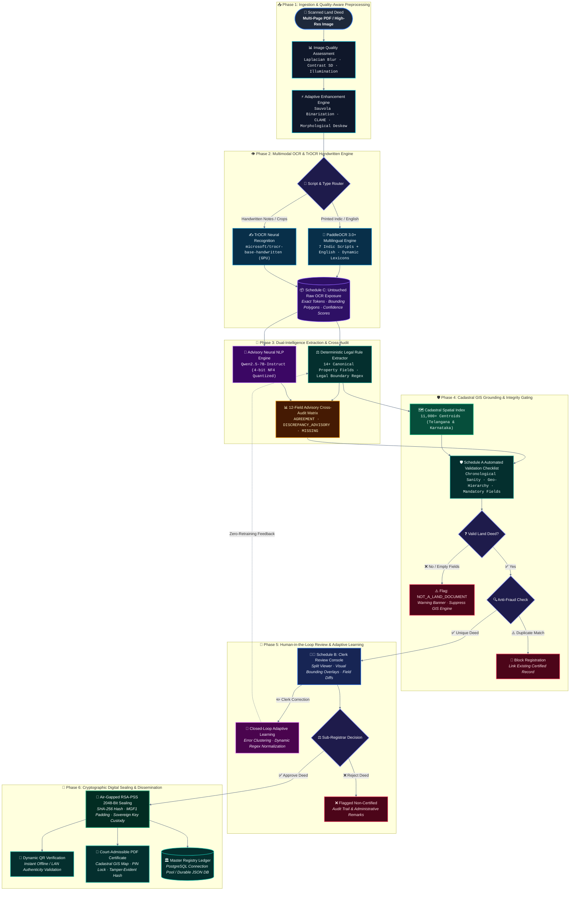

# OneBhoomi (వన్‌భూమి / वनभूमि) 🏛️📜

**Air-Gapped Multilingual Land Record Digitization, Cadastral GIS Grounding, Advisory Neural NLP, Adaptive Learning & RSA-PSS Cryptographic Sealing System**

[](https://www.python.org/)
[](https://github.com/PaddlePaddle/PaddleOCR)
[-purple.svg?style=for-the-badge&logo=huggingface&logoColor=white)](https://huggingface.co/Qwen/Qwen2.5-7B-Instruct)
[](https://cryptography.io/)
[-teal.svg?style=for-the-badge&logo=leaflet&logoColor=white)](https://leafletjs.com/)
[](https://www.postgresql.org/)
[-brightgreen.svg?style=for-the-badge&logo=pytest&logoColor=white)]()
[]()

---

## 📖 Overview & Executive Summary

**OneBhoomi** is a production-grade, sovereign, offline-first intelligent land records digitization, verification, and cryptographic sealing platform engineered for Indian Sub-Registrar Offices (SROs), Revenue Departments, and Land Administration Authorities.

Conforming to the **Digital India Land Records Modernization Programme (DILRMP)** and Land Records Management Systems (LRMS) standards, OneBhoomi solves the core bottlenecks of historical deed management:
- **Paper Degradation & Legibility**: Historical deeds suffer from physical discoloration, ink bleed, tears, and low contrast. OneBhoomi restores document fidelity via automated quality telemetry and adaptive Sauvola binarization.
- **Multilingual Complex Scripts**: Supports **7 Indic languages + English** (`Telugu`, `Hindi`, `Kannada`, `Tamil`, `Marathi`, `Urdu`, `English`) using Unicode script routing paired with dedicated **TrOCR** handwriting recognition.
- **Evidentiary Provenance**: Preserves **Schedule C Untouched Raw OCR** tokens, bounding polygons, and confidence scores for court-admissible audit trails.
- **Dual-Intelligence Extraction & Cross-Audit**: Extracts 14+ canonical property fields via deterministic legal regex rules, while running **Qwen2.5-7B-Instruct (4-bit NF4)** in advisory mode to cross-audit discrepancies without cloud dependency.
- **Spatial Validation**: Grounds deeds against **11,000+ revenue village centroids** across Telangana and Karnataka with cadastral parcel approximations.
- **Anti-Fraud & Double-Registration Prevention**: Dual-layer SHA-256 byte fingerprinting and canonical identity ledger matching prevent duplicate registrations and fraudulent resale.
- **Closed-Loop Adaptive Learning**: Captures clerk review corrections to build dynamic normalization patterns without model retraining.
- **Cryptographic Trust**: Digitally seals approved deeds with **RSA-PSS 2048-bit** asymmetric signatures, issuing instant offline verification QR codes and court-admissible PIN-locked PDF certificates.

---

## ⚡ High-Level System Lifecycle

```mermaid
flowchart LR
    subgraph P1 ["1. Ingest & OCR"]
        direction TB
        IN["📄 Deed Scan / PDF"] --> PRE["✨ Quality Telemetry<br/>& Sauvola Binarization"]
        PRE --> OCR["🔤 PaddleOCR 3.0+<br/>& TrOCR Handwritten"]
    end

    subgraph P2 ["2. Dual AI & GIS"]
        direction TB
        OCR --> RULE["⚖️ Legal Rules Extractor<br/><i>(14+ Canonical Fields)</i>"]
        OCR --> LLM["🤖 Qwen2.5-7B Advisory<br/><i>(4-bit NF4 Quantized)</i>"]
        RULE & LLM --> DIFF["📊 12-Field Cross-Audit<br/><i>Discrepancy Matrix</i>"]
        RULE --> GIS["🗺️ Cadastral GIS Index<br/><i>(11,000+ Centroids)</i>"]
    end

    subgraph P3 ["3. Governance & Review"]
        direction TB
        DIFF & GIS --> GATE{"🛡️ Schedule A<br/>Validation Gating"}
        GATE -->|"Valid & Unique"| CLERK["👨‍💼 Schedule B Review<br/><i>Split Viewer & Diffs</i>"]
        CLERK -->|"Feedback"| ADAPT["🔄 Closed-Loop Learning<br/><i>Zero-Retrain Normalizer</i>"]
        CLERK --> APPR{"⚖️ Sub-Registrar<br/>Decision"}
    end

    subgraph P4 ["4. Sovereign Trust"]
        direction TB
        APPR -->|"Approved"| SEAL["🔐 RSA-PSS 2048-bit<br/><i>Digital Signature Seal</i>"]
        SEAL --> QR["📲 Dynamic QR Verification<br/><i>Air-Gapped Offline Audit</i>"]
        SEAL --> PDF["📜 Court-Admissible PDF<br/><i>PIN-Locked Certificate</i>"]
    end

    P1 ==> P2 ==> P3 ==> P4

    classDef stage1 fill:#0f172a,stroke:#06b6d4,stroke-width:2px,color:#f8fafc;
    classDef stage2 fill:#1e1b4b,stroke:#8b5cf6,stroke-width:2px,color:#f5f3ff;
    classDef stage3 fill:#172554,stroke:#3b82f6,stroke-width:2px,color:#eff6ff;
    classDef stage4 fill:#022c22,stroke:#10b981,stroke-width:2px,color:#ecfdf5;

    class IN,PRE,OCR stage1;
    class RULE,LLM,DIFF,GIS stage2;
    class GATE,CLERK,ADAPT,APPR stage3;
    class SEAL,QR,PDF stage4;
```



---

## 🏛️ Comprehensive End-to-End Operational Architecture



---

## 🔬 In-Depth Engineering & Subsystem Breakdown

### 1. Quality-Aware Preprocessing Pipeline (`image_preprocessing.py`)
Historical deeds in Indian archives are frequently plagued by paper yellowing, fungal discoloration, ink bleeding, and scanning skews.
- **Image Quality Telemetry**: Evaluates Laplacian blur variance, contrast standard deviation, mean illumination, and noise density before applying processing operations.
- **Adaptive Sauvola Binarization**: Dynamically segments foreground ink from background fiber based on local neighborhood standard deviation:
  $$T(x,y) = m(x,y) \cdot \left[1 + k \cdot \left(\frac{s(x,y)}{R} - 1\right)\right]$$
- **Contrast Limited Adaptive Histogram Equalization (CLAHE)**: Amplifies faint or faded rubber stamp impressions and seals while clipping gradient noise.
- **Hough Line Morphological Deskewing**: Straightens documents using detected document boundaries and orientation vectors.

### 2. Multimodal OCR & TrOCR Handwritten Engine (`land_document_extractor.py`, `kaggle_gpu_server.py`)
- **Multilingual Indic Support**: Handles **7 Indic languages + English** (`en`, `te`, `hi`, `kn`, `ta`, `mr`, `ur`).
- **Unicode-Based Script Routing**: Evaluates Unicode code-point blocks line-by-line, dynamically activating script-specific lexicons to prevent English character bias.
- **Dedicated TrOCR Handwriting Model**: Crops containing handwritten endorsements, marginal signatures, and sub-registrar notes are automatically routed to `microsoft/trocr-base-handwritten` running on GPU.
- **Flexible Deployment**: Executes natively on air-gapped CPU workstations, or offloads computation to remote Tesla T4 multi-GPU nodes (Kaggle/Colab) via authenticated tunnels.

### 3. Schedule C: Untouched Raw OCR Provenance (`web_app.py`, `test_raw_ocr_exposure.py`)
- In judicial proceedings, maintaining an untampered chain of custody is mandatory.
- Preserves raw character tokens, polygon bounding coordinates (`rec_polys`), individual model recognition confidences (`rec_scores`), and detected script per line.
- Exposed via immutable endpoint `GET /api/raw_ocr` to enable downstream legal cross-examination.

### 4. Rule-Governed Legal Semantic Extractor (`semantic_extractor.py`)
Deterministic, rule-based legal entity extraction engine supporting 14+ canonical property fields:
- **Deed Identification**: Document Type (Sale Deed, Gift Deed, Partition Deed, Mortgage, GPA), Deed Registration Number, Execution Date, Presentation Date.
- **Parties**: Executants (Vendors/Sellers), Claimants (Purchasers/Buyers), parental relationships (`S/o`, `W/o`, `D/o`), and residential addresses.
- **Parcel Geometrics**: Survey Number, Sub-Survey / Plot Number, Property Extent (Acres, Guntas, Square Yards, Cents, Sq. Metres).
- **Administrative Hierarchy**: Revenue Village, Mandal / Tehsil, District, State.
- **Financials & Stamp Duty**: Consideration Amount, Non-Judicial Stamp Paper serial numbers, and licensed stamp vendor endorsements.

### 5. Secondary Advisory Neural NLP Engine (`neural_nlp_service.py`, `kaggle_gpu_server.py`)
- **Model**: Powered by **Qwen2.5-7B-Instruct** loaded with **4-bit NF4 quantization** (`BitsAndBytesConfig` + `accelerate`) sharded across dual Tesla T4 GPUs.
- **Anti-Hallucination Guardrails**: Prompts enforce zero assumption; facts must be explicitly backed by extracted OCR spans. Undetermined fields strictly default to `null`.
- **Non-Blocking Architecture**: Operates strictly as a secondary advisory auditor. If GPU connections drop or timeout, the primary deterministic extraction continues unimpeded.

### 6. 12-Field Deterministic Cross-Audit Matrix (`neural_nlp_service.py`)
Cross-references rule-based extractions against neural LLM results across 12 canonical fields:
1. `document_type` · 2. `document_number` · 3. `document_date` · 4. `vendor` · 5. `purchaser` · 6. `survey_number`
7. `sub_survey_number` · 8. `property_area` · 9. `village` · 10. `mandal` · 11. `district` · 12. `consideration_amount`

| Status Flag | Technical Meaning | Clerk UI Action |
|:---|:---|:---|
| `AGREEMENT` | Both extractors yielded identical or normalized values | Highlighted in emerald green (Auto-verified) |
| `DISCREPANCY_ADVISORY` | Both extractors extracted values, but text differs | Highlighted in amber; shows side-by-side diff with evidence lines |
| `SEMANTIC_MISSING` | Qwen identified a field present in text that regex missed | Highlighted in blue for one-click adoption |
| `NEURAL_MISSING` | Rule-based parser extracted a field that Qwen omitted | Default rule extraction retained |

### 7. Cadastral GIS Spatial Grounding (`gis_service.py`)
- Embedded offline spatial index covering over **11,000+ revenue villages** and survey boundaries across Telangana and Karnataka.
- Automatically resolves GPS coordinates from extracted village and mandal names.
- Renders interactive boundary maps via Leaflet with cadastral parcel approximations.

### 8. Schedule A: Automated Validation & Non-Land Classifier (`verification_service.py`)
- **Non-Land Document Classifier**: Filters out irrelevant uploads (invoices, academic marks cards, resumes). Flags `NOT_A_LAND_DOCUMENT`, displays warning banners, and suppresses GIS rendering.
- **Rule Verification Checklist**:
  - Mandatory field completeness (Deed No, Registration Date, Survey No, Village).
  - Chronological verification ($\text{Stamp Date} \le \text{Execution Date} \le \text{Registration Date}$).
  - Jurisdictional consistency matching Village $\rightarrow$ Mandal $\rightarrow$ District.

### 9. Dual-Layer Anti-Fraud & Double-Registration Prevention (`verification_service.py`)
- **Layer 1 (Binary SHA-256 Fingerprinting)**: Detects duplicate re-uploads of previously submitted digital scans.
- **Layer 2 (Canonical Identity Ledger)**: Normalizes and checks `[Document Number + Survey Number + Village]` against all certified records to prevent fraudulent attempts to re-register already-sealed properties.

### 10. Schedule B: Human-in-the-Loop Clerk Review Console (`web_app.py`)
- Synchronized split-screen review desk:
  - **Left Pane**: Zoomable, multi-page deed viewer with OCR polygon overlay toggles.
  - **Right Pane**: Structured editable form fields, confidence indicators, and field-level OCR provenance links.
  - **Advisory Audit Panel**: Displays Qwen neural cross-check results, highlighting agreement and discrepancy flags.
- Sub-Registrar can approve, correct, or reject records with administrative audit remarks.

### 11. Closed-Loop Adaptive OCR Learning (`ocr_learning_service.py`)
- Captures corrections made by registry clerks during review.
- Clusters recurrent OCR character errors (e.g., `278 / 281` $\rightarrow$ `278, 281`) and builds normalization rules scoped to document type and language.
- Re-applies learned normalization rules to future incoming scans without requiring neural model retraining or altering raw OCR records.

### 12. Air-Gapped RSA-PSS Cryptographic Sealing (`verification_service.py`)
- Generates **2048-bit RSA key pairs** kept in local hardware/file custody (`verification_keys/`).
- Canonicalizes verified deed facts into an immutable JSON representation.
- Signs payload with **RSA-PSS using SHA-256 and MGF1 padding**.
- Key management utilities provide encrypted backup and recovery (`backup_signing_key.py`, `restore_signing_key.py`).

### 13. Court-Admissible PIN-Protected PDF Certificate (`certificate_pdf_service.py`)
- Compiles official, tamper-evident certificates with:
  - State emblem and official OneBhoomi certification seal.
  - Verified property facts, party details, and transaction metrics.
  - High-resolution Cadastral GIS satellite/boundary parcel map.
  - Cryptographic digital signature hash, public key fingerprint, and dynamic verification QR code.
  - Optional 128-bit PIN/password encryption for citizen privacy.

### 14. Dual-Engine Persistence & Scalability (`postgres_store.py`, `dashboard_view.py`)
- **High-Concurrency PostgreSQL Pool**: Thread-safe connection pooling, automated schema creation (`schema.sql`), JSONB indexing, and transactional rollbacks.
- **Durable Zero-Dependency JSON Fallback**: Runs out-of-the-box without requiring database setup.
- **Operations Dashboard**: Real-time analytics, SVG charts, registration velocity, and 5-language UI switching (`English`, `Telugu`, `Hindi`, `Kannada`, `Tamil`).

---

## 👥 Role-Based Access Control (RBAC)

| Role | Access Permissions | Primary Responsibility |
|:---|:---|:---|
| **Intake Clerk** | Upload scans, view raw OCR, perform Schedule B field corrections | Intake & initial data extraction |
| **Sub-Registrar / Officer** | Full review desk, approve/reject deeds, execute RSA-PSS digital seal | Final statutory approval & certification |
| **System Administrator** | User management, key backup/recovery, PostgreSQL migration, audit logs | System maintenance & security |
| **Public Citizen** | Public verification portal (`/`), dynamic QR scan, certificate download | Authenticity verification |

---

## 📡 REST API Specification

| Method | Endpoint | Description | Auth Required |
|:---|:---|:---|:---:|
| `POST` | `/api/upload` | Upload multi-page deed scan (PDF/Image) for processing | Yes |
| `GET` | `/api/raw_ocr` | Fetch immutable Schedule C raw OCR tokens and polygons | Yes |
| `GET` | `/api/records` | List all records with status filters (`pending`, `sealed`, `rejected`) | Yes |
| `GET` | `/api/verify/<doc_id>` | Fetch detailed verification facts, GIS coordinates & audit flags | No |
| `POST` | `/api/approve/<doc_id>` | Sub-Registrar approval & RSA-PSS cryptographic sealing | Officer |
| `POST` | `/api/reject/<doc_id>` | Sub-Registrar rejection with mandatory audit reason | Officer |
| `GET` | `/api/cert/pdf/<doc_id>` | Download court-admissible PIN-locked PDF certificate | No |
| `POST` | `/api/verify_signature` | Validate cryptographic signature against raw payload | No |
| `GET` | `/api/gis/<village>` | Query cadastral GIS centroids and spatial boundaries | No |
| `GET` | `/api/notifications` | Real-time SSE/polling event stream for registry alerts | Yes |
| `GET` | `/openapi.json` | Complete OpenAPI 3.0 specification | No |

---

## 🚀 Quick Start Guide

### Prerequisites
- Python 3.10 or higher
- Modern Web Browser (Chrome / Edge / Firefox)
- Optional: CUDA-capable GPU (for local Qwen / TrOCR inference) or Kaggle/Colab T4 account

### 1. Clone & Environment Setup

```bash
# Clone the repository
git clone https://github.com/saiujwal-hub/land-digitiztion.git
cd land-digitiztion

# Create and activate virtual environment (Windows PowerShell)
python -m venv .venv
.venv\Scripts\Activate.ps1

# Linux / macOS:
# python3 -m venv .venv
# source .venv/bin/activate
```

### 2. Install Dependencies

```bash
# Install core dependencies (Web app, Crypto, OCR, PDF, GIS)
pip install -r requirements.txt

# Optional: Install Neural NLP dependencies for local Qwen2.5-7B inference
pip install -r requirements-neural-nlp.txt
```

### 3. Launch the Application Server

```bash
python web_app.py
```

The server initializes on port `8001`:
- 🏛️ **Intake Desk (Upload Scan)**: [http://127.0.0.1:8001/new](http://127.0.0.1:8001/new)
- 📊 **Operations Dashboard**: [http://127.0.0.1:8001/dashboard](http://127.0.0.1:8001/dashboard)
- 🌐 **Public Citizen Verification Portal**: [http://127.0.0.1:8001/](http://127.0.0.1:8001/)
- 📑 **API Documentation (Swagger UI)**: [http://127.0.0.1:8001/docs](http://127.0.0.1:8001/docs)

### 4. (Optional) Connect Remote Kaggle/Colab GPU Worker

To utilize dual Tesla T4 GPUs on Kaggle or Colab for accelerated multilingual OCR and Qwen2.5-7B inference:
1. Open `ocr_colab_benchmark.ipynb` or run `kaggle_gpu_server.py` in your GPU notebook.
2. Launch a Cloudflare or Ngrok tunnel to expose port `5000`.
3. Update the remote OCR endpoint in OneBhoomi:
   ```bash
   python update_ocr_url.py --url https://your-tunnel-url.trycloudflare.com
   ```

---

## 🧪 Comprehensive Automated Test Suite

OneBhoomi includes a battle-tested regression suite with **101 automated tests** covering image preprocessing, multilingual OCR, legal regex rules, Qwen advisory comparison, GIS, anti-fraud, and RSA-PSS cryptographic integrity:

```bash
# Run the complete test suite (101 automated tests)
python -m unittest test_not_a_land_document.py \
                   test_raw_ocr_exposure.py \
                   test_semantic_accuracy_and_conflicts.py \
                   test_generic_extraction_rules.py \
                   test_image_preprocessing.py \
                   test_ocr_learning_service.py \
                   test_remote_multilingual_ocr.py \
                   test_land_extractor.py \
                   test_new_parser.py \
                   test_ocr_runner.py \
                   test_neural_nlp.py \
                   test_neural_pipeline_integration.py
```

### End-to-End Real Document Simulation
Execute a complete verification run on an authentic land deed through Preprocessing $\rightarrow$ OCR $\rightarrow$ Semantic Extraction $\rightarrow$ Qwen Neural NLP $\rightarrow$ 12-Field Comparison $\rightarrow$ Verification Sealing:

```bash
python run_real_end_to_end_validation.py
```

---

## 🔒 Security, Key Custody & Compliance

- **Zero Cloud Leakage**: Core OCR, semantic parsing, GIS indexing, and cryptographic signing run entirely offline.
- **Air-Gapped Key Generation**: The 2048-bit RSA private key is generated within `verification_keys/` on initial boot and never leaves the registry workstation.
- **Key Backup & Disaster Recovery**: Secure backup and restore scripts are provided:
  ```bash
  # Backup signing key
  python backup_signing_key.py --out backup_keys/
  # Restore signing key
  python restore_signing_key.py --src backup_keys/
  ```
  *(See [KEY_RECOVERY.md](KEY_RECOVERY.md) for detailed emergency protocols).*
- **Tamper-Evident Hashing**: Any modification to certified property facts invalidates the RSA-PSS signature verification immediately.
- **Advisory Model Isolation**: Qwen2.5-7B runs exclusively in advisory mode; external network failure can never block statutory land registration.

---

## 📁 Repository Structure

```
├── web_app.py                          # Main HTTP server, routes, review console, and intake desk
├── verification_service.py             # RSA-PSS 2048 signing, duplicate check, and validation rules
├── semantic_extractor.py               # Deterministic legal document parser (14+ canonical fields)
├── neural_nlp_service.py               # Qwen2.5-7B neural NLP client & 12-field advisory auditor
├── land_document_extractor.py          # Multilingual OCR line parser & Unicode script detector
├── image_preprocessing.py              # Quality telemetry, Sauvola binarization, CLAHE, deskew
├── ocr_learning_service.py             # Closed-loop adaptive clerk feedback & normalization
├── dashboard_view.py                   # Operations analytics portal, KPIs, and master ledger
├── gis_service.py                      # Cadastral spatial index (Telangana & Karnataka)
├── certificate_pdf_service.py          # Court-admissible PIN-locked PDF certificate generator
├── postgres_store.py                   # PostgreSQL connection pooling & transactional persistence
├── auth_service.py                     # Role-based access control (Clerk, Officer, Admin)
├── notification_service.py             # Event streaming & real-time notification alerts
├── kaggle_gpu_server.py                # Multi-GPU Kaggle worker (PaddleOCR + TrOCR + Qwen2.5-7B)
├── update_ocr_url.py                   # Remote GPU tunnel sync and heartbeat checker
├── backup_signing_key.py               # Encrypted RSA key backup utility
├── restore_signing_key.py              # Emergency RSA key recovery utility
├── run_real_end_to_end_validation.py   # Real document production simulation runner
├── schema.sql                          # Production PostgreSQL relational schema
├── openapi.yaml                        # Standard OpenAPI 3.0 API documentation
├── requirements.txt                    # Core platform dependencies
├── requirements-neural-nlp.txt         # Neural NLP (Transformers, BitsAndBytes, Torch) dependencies
├── KEY_RECOVERY.md                     # Air-gapped cryptographic recovery protocol
├── 01-onebhoomi-final.html             # Public verification landing portal
├── logo.png                            # Official OneBhoomi emblem
└── README.md                           # Comprehensive documentation & architecture flowcharts
```

---

## 👥 Contributors & Maintainers

<!-- ALL-CONTRIBUTORS-LIST:START - Do not remove or modify this section -->
<table>
  <tr>
    <td align="center"><a href="https://github.com/saiujwal-hub"><br /><sub><b>Meesala Sai Ujwal</b></sub></a><br /><a href="https://github.com/saiujwal-hub" title="Core Pipeline & OCR">💻 Architecture & Core Pipeline</a></td>
    <td align="center"><a href="https://github.com/Samarth7887"><br /><sub><b>Samarth</b></sub></a><br /><a href="https://github.com/Samarth7887" title="UI & Spatial Grounding">🎨 Cadastral GIS & UI</a></td>
    <td align="center"><a href="https://github.com/yuvanreddy404"><br /><sub><b>Yuvan Reddy</b></sub></a><br /><a href="https://github.com/yuvanreddy404" title="Security & Maintenance">🛡️ Cryptography & Security</a></td>
  </tr>
</table>
<!-- ALL-CONTRIBUTORS-LIST:END -->

- **[Meesala Sai Ujwal](https://github.com/saiujwal-hub)** ([@saiujwal-hub](https://github.com/saiujwal-hub)) — Project Lead & Pipeline Architecture
- **[Samarth](https://github.com/Samarth7887)** ([@Samarth7887](https://github.com/Samarth7887)) — Cadastral GIS & Frontend Review Console
- **[Yuvan Reddy](https://github.com/yuvanreddy404)** ([@yuvanreddy404](https://github.com/yuvanreddy404)) — Cryptography, Security & Persistence

---

<div align="center">
  <sub>Built with pride for the Digital India Land Records Modernization Programme (DILRMP).</sub>
</div>
