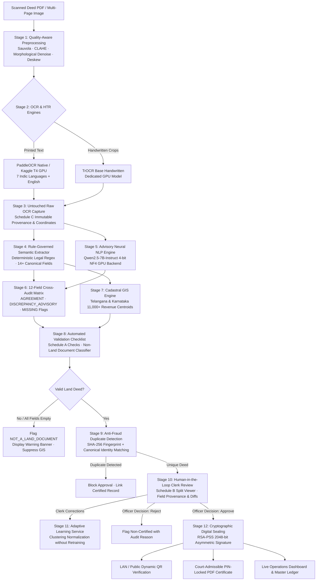

# OneBhoomi (వన్‌భూమి / वनभूमि) 🏛️📜

**Air-Gapped Multilingual Land Record Digitization, Cadastral GIS Grounding, Advisory Neural NLP, Adaptive Learning & RSA-PSS Cryptographic Sealing System**

[](https://www.python.org/)
[]()
[](https://github.com/PaddlePaddle/PaddleOCR)
[-purple.svg)](https://huggingface.co/Qwen/Qwen2.5-7B-Instruct)
[](https://cryptography.io/)
[]()
[-brightgreen.svg)]()

OneBhoomi is a production-grade, offline-first intelligent land records digitization and validation platform engineered for Indian sub-registrar offices, revenue departments, and land administration authorities. Aligned with the **Digital India Land Records Modernization Programme (DILRMP)** and Land Records Management Systems (LRMS), OneBhoomi extracts structured legal facts from historical deeds, performs secondary neural advisory cross-auditing with **Qwen2.5-7B-Instruct**, validates land parcels against cadastral GIS datasets, detects duplicate registrations and invalid files, enables human-in-the-loop clerk review, learns continuously from human corrections, and cryptographically seals verified deeds with **RSA-PSS 2048-bit** digital signatures.

---

## 🏛️ Comprehensive End-to-End Workflow Architecture



---

## 🔬 In-Depth Workflow Breakdown

### Stage 1: Quality-Aware Image Preprocessing (`image_preprocessing.py`)
Historical Indian registry records often suffer from ink bleed, paper discoloration, skewing, and physical degradation. The preprocessing pipeline conducts:
- **Telemetry Assessment**: Computes image quality metrics before processing (Laplacian blur variance, contrast standard deviation, mean illumination, background noise).
- **Adaptive Sauvola Binarization**: Dynamically segments degraded foreground ink from background fiber.
- **Contrast Limited Adaptive Histogram Equalization (CLAHE)**: Amplifies faded stamp impressions without blooming.
- **Automated Deskew & Shadow Removal**: Detects horizontal rule lines and morphological variance to straighten tilted scans.

### Stage 2: Dual OCR & Dedicated HTR Engines (`land_document_extractor.py`, `kaggle_gpu_server.py`)
- **Multilingual Printed Text**: Supports **7 Indic languages + English** (`en`, `te`, `hi`, `kn`, `ta`, `mr`, `ur`).
- **Unicode-Based Script Routing**: Evaluates Unicode code-point blocks on a per-line basis, dynamically choosing recognition dictionaries without English language bias.
- **Specialized Handwritten Text Recognition (HTR)**: High-resolution crops of handwritten notes, marginalia, and signatures are dispatched to a dedicated **TrOCR** (`microsoft/trocr-base-handwritten`) neural model running on GPU hardware.
- **Execution Flexibility**: Runs seamlessly on local air-gapped CPU workstations or offloads to a remote multi-GPU Kaggle/Colab server (Tesla T4 x2) over authenticated tunnels.

### Stage 3: Untouched Raw OCR Exposure — Schedule C (`web_app.py`, `test_raw_ocr_exposure.py`)
- For legal and evidentiary compliance, original OCR output is stored unmodified.
- Preserves exact character strings, token bounding box polygons (`rec_polys`), individual model confidence scores (`rec_scores`), and detected script per line.
- Immutably exposed via `GET /api/raw_ocr` to guarantee transparency in judicial proceedings.

### Stage 4: Rule-Governed Legal Semantic Extraction (`semantic_extractor.py`)
Extracts 14+ canonical property attributes using deterministic, noise-tolerant legal parsing rules:
- **Deed Identification**: Document Type (Sale Deed, Gift Deed, Partition Deed, GPA), Registered Deed Number, Execution Date, Presentation Date.
- **Parties**: Executants / Vendors, Claimants / Purchasers, parental relationships, and addresses.
- **Parcel Geometrics**: Survey Number, Sub-Survey / Plot Number, Extent / Property Area (Sq. Yards / Acres / Cents / Guntas).
- **Jurisdiction Hierarchy**: Village, Mandal / Tehsil, District, State.
- **Stamp & Duty Records**: Non-judicial stamp paper serial numbers, stamp denominations, and licensed vendor endorsements.

### Stage 5: Secondary Neural NLP Advisory Engine (`neural_nlp_service.py`, `kaggle_gpu_server.py`)
- **Model**: Powered by **Qwen2.5-7B-Instruct** loaded with **4-bit NF4 quantization** (`BitsAndBytesConfig` + `accelerate`) sharded across dual Tesla T4 GPUs.
- **Anti-Hallucination Guardrails**: Strictly prompted to extract values *only* when explicitly evidenced in the supplied OCR text; missing or indeterminate fields are strictly returned as `null`.
- **Non-Blocking Architecture**: Runs purely as an advisory auditor. The authoritative baseline semantic extractor remains fully operational even if the GPU NLP model is offline or unreachable.

### Stage 6: 12-Field Cross-Audit Matrix (`neural_nlp_service.py`)
The system conducts an automated, field-by-field cross-comparison across all 12 canonical legal attributes:
1. `document_type`
2. `document_number`
3. `document_date`
4. `vendor`
5. `purchaser`
6. `survey_number`
7. `sub_survey_number`
8. `property_area`
9. `village`
10. `mandal`
11. `district`
12. `consideration_amount`

Each field is classified into one of four deterministic advisory states:
- **`AGREEMENT`**: Both semantic extractor and Qwen extracted identical or harmonized values.
- **`DISCREPANCY_ADVISORY`**: Both extractors produced values, but they diverge (highlighted with evidence lines for clerk inspection).
- **`SEMANTIC_MISSING`**: Qwen identified a field value present in OCR text that rule-based regex missed.
- **`NEURAL_MISSING`**: Rule-based extractor successfully resolved a field that Qwen omitted.

### Stage 7: Cadastral GIS Spatial Grounding (`gis_service.py`)
- Integrated offline spatial index containing over **11,000+ revenue villages** and survey coordinates across Telangana and Karnataka.
- Resolves spatial coordinates from extracted village and mandal names.
- Renders administrative boundaries and parcel boundary approximations on interactive Leaflet maps.

### Stage 8: Automated Validation & Non-Land Document Classifier — Schedule A (`verification_service.py`)
- **Non-Land Document Classification**: Detects when an uploaded document lacks core land registry attributes (e.g., resumes, invoices, academic papers). Automatically flags `NOT_A_LAND_DOCUMENT`, displays warning banners, and completely suppresses GIS map rendering.
- **Rule Verification Checklist**:
  - Mandatory field completeness (document number, deed type, survey number).
  - Chronological date validation (stamp purchase date $\le$ document execution date $\le$ registration date).
  - Geographical consistency between village, mandal, and district.

### Stage 9: Dual-Layer Anti-Fraud & Double-Registration Prevention
- **Layer 1 (Binary SHA-256 Fingerprint)**: Detects immediate re-uploads of identical digital files.
- **Layer 2 (Canonical Identity Ledger)**: Checks normalized `[Document Number + Survey Number + Village]` against the certified ledger to block fraudulent attempts to register an already-sealed property parcel.

### Stage 10: Human-in-the-Loop Clerk Review Console — Schedule B (`web_app.py`)
- Interactive split-screen review console:
  - **Left Pane**: Zoomable, pannable multi-page document scan viewer.
  - **Right Pane**: Structured editable form fields, confidence indicators, and field-level OCR provenance links.
  - **Advisory Audit Panel**: Displays Qwen neural cross-check results, highlighting any agreement or conflict flags.
- Authorizing officers can approve, correct, or reject records with auditable administrative remarks.

### Stage 11: Closed-Loop Adaptive OCR Learning (`ocr_learning_service.py`)
- Captures corrections made by registry clerks during review.
- Clusters recurrent OCR character errors (e.g., `278 / 281` $\rightarrow$ `278, 281`) and builds normalization rules scoped to document type and language.
- Re-applies learned normalization rules to future incoming scans without requiring neural model retraining or altering raw OCR records.

### Stage 12: Air-Gapped RSA-PSS Cryptographic Sealing (`verification_service.py`)
- Generates a **2048-bit RSA key pair** stored in local secure custody (`verification_keys/`).
- Constructs a canonical JSON payload representing the final verified document facts.
- Cryptographically signs the payload using **RSA-PSS with SHA-256 and MGF1 padding**.
- Generates a tamper-evident digital certificate with dynamic LAN / Public QR codes for instant offline verification.

### Stage 13: Court-Admissible PIN-Protected PDF Certificate (`certificate_pdf_service.py`)
- Automatically compiles a sealed, printable certificate containing:
  - Official state emblem and OneBhoomi certification seal.
  - Verified property facts, party details, and transaction metrics.
  - Embedded high-resolution Cadastral GIS satellite/boundary map.
  - Cryptographic digital signature hash, public key fingerprint, and verification QR code.
  - Optional 128-bit PIN/password lock for citizen privacy.

### Stage 14: Operations Dashboard & Live Analytics (`dashboard_view.py`)
- Real-time administrative dashboard featuring:
  - **Executive KPIs**: Total Records, Certified & Sealed, Clerk Review Queue, Flagged / Non-Certified.
  - **Visual SVG Analytics**: Registration velocity trends and classification breakdown.
  - **Master Deed Register**: Searchable, filterable ledger with instant reset (`/reset`) capabilities.
  - **Localization**: Five-language UI switching (English, Telugu, Hindi, Kannada, Tamil).

---

## 🚀 Quick Start Guide

### Prerequisites
- Python 3.10 or higher
- Git
- Modern Web Browser (Chrome / Edge / Firefox)

### Installation

```bash
# 1. Clone the repository
git clone https://github.com/saiujwal-hub/land-digitiztion.git
cd land-digitiztion

# 2. Create and activate a virtual environment (Windows)
python -m venv .venv
.venv\Scripts\activate

# Linux / macOS:
# python3 -m venv .venv
# source .venv/bin/activate

# 3. Install core dependencies
pip install -r requirements.txt

# 4. Optional: Install neural NLP advisory dependencies (for local/remote Qwen inference)
pip install -r requirements-neural-nlp.txt
```

### Starting the Local Server

```bash
python web_app.py
```

The web server will initialize and listen on port `8001`:
- **Intake Desk (Upload Scan)**: [http://127.0.0.1:8001/new](http://127.0.0.1:8001/new)
- **Operations Dashboard**: [http://127.0.0.1:8001/dashboard](http://127.0.0.1:8001/dashboard)
- **Public Portal**: [http://127.0.0.1:8001/](http://127.0.0.1:8001/)

---

## 🧪 Automated Testing Suite

OneBhoomi includes a comprehensive regression test suite containing **101 automated tests** covering OCR, preprocessing, semantic extraction, neural NLP, advisory cross-checks, GIS, and security:

```bash
# Run the complete test suite (101 tests)
python -m unittest test_not_a_land_document.py \
                   test_raw_ocr_exposure.py \
                   test_semantic_accuracy_and_conflicts.py \
                   test_generic_extraction_rules.py \
                   test_image_preprocessing.py \
                   test_ocr_learning_service.py \
                   test_remote_multilingual_ocr.py \
                   test_land_extractor.py \
                   test_new_parser.py \
                   test_ocr_runner.py \
                   test_neural_nlp.py \
                   test_neural_pipeline_integration.py
```

### Real End-to-End Validation
To run a complete production simulation on an authentic land deed through Preprocessing $\rightarrow$ OCR $\rightarrow$ Semantic Extraction $\rightarrow$ Qwen Neural NLP $\rightarrow$ 12-Field Comparison $\rightarrow$ Verification Sealing:

```bash
python run_real_end_to_end_validation.py
```

---

## 📁 Repository Structure

```
├── web_app.py                          # Main HTTP server, routes, review console, and intake desk
├── verification_service.py             # RSA-PSS 2048 signing, duplicate check, and validation rules
├── semantic_extractor.py               # Deterministic legal document parser (14+ canonical fields)
├── neural_nlp_service.py               # Qwen2.5-7B neural NLP client & 12-field advisory auditor
├── land_document_extractor.py          # Multilingual OCR line parser & Unicode script detector
├── image_preprocessing.py              # Quality telemetry, Sauvola binarization, CLAHE, deskew
├── ocr_learning_service.py             # Closed-loop adaptive clerk feedback & normalization
├── dashboard_view.py                   # Operations analytics portal, KPIs, and master ledger
├── gis_service.py                      # Cadastral spatial index (Telangana & Karnataka)
├── certificate_pdf_service.py          # Court-admissible PIN-locked PDF certificate generator
├── kaggle_gpu_server.py                # Multi-GPU Kaggle worker (PaddleOCR + TrOCR + Qwen2.5-7B)
├── update_ocr_url.py                   # Remote GPU tunnel sync and heartbeat checker
├── run_real_end_to_end_validation.py   # Real document production simulation runner
├── requirements.txt                    # Core platform dependencies
├── requirements-neural-nlp.txt         # Neural NLP (Transformers, BitsAndBytes, Torch) dependencies
├── test_neural_nlp.py                  # Unit tests for Qwen NLP service & comparison matrix
├── test_neural_pipeline_integration.py # Unit tests for advisory neural pipeline integration
├── test_not_a_land_document.py         # Tests for non-land document classification & GIS suppression
├── test_raw_ocr_exposure.py            # Tests for Schedule C untouched raw OCR immutability
├── test_semantic_accuracy_and_conflicts.py # Tests for legal entity extraction & conflict detection
├── test_generic_extraction_rules.py    # Zero-bias generic extraction regression tests
├── test_image_preprocessing.py         # Image telemetry and binarization tests
├── test_ocr_learning_service.py        # Feedback clustering and rule generation tests
├── test_remote_multilingual_ocr.py     # Remote GPU OCR worker communication tests
├── 01-onebhoomi-final.html             # Public verification landing portal
├── logo.png                            # Official OneBhoomi emblem
└── README.md                           # Comprehensive documentation
```

---

## 🔒 Security & Air-Gapped Compliance

- **Zero Mandatory External Cloud Dependency**: All core OCR, HTR, semantic extraction, GIS indexing, and cryptographic signing run strictly on local infrastructure.
- **Air-Gapped Key Custody**: RSA private signing keys are generated inside `verification_keys/` on initial setup and never leave the registry workstation.
- **Tamper-Evident Hashing**: Any post-certification tampering with verified record facts immediately breaks RSA-PSS verification.
- **Advisory Isolation**: Secondary neural NLP runs strictly in advisory mode, ensuring foreign cloud or GPU outages can never obstruct official deed registration.

---

## 👥 Contributors

<!-- ALL-CONTRIBUTORS-LIST:START - Do not remove or modify this section -->
<table>
  <tr>
    <td align="center"><a href="https://github.com/saiujwal-hub"><br /><sub><b>Meesala Sai Ujwal</b></sub></a><br /><a href="https://github.com/saiujwal-hub" title="Core Pipeline & OCR">💻</a></td>
    <td align="center"><a href="https://github.com/Samarth7887"><br /><sub><b>Samarth</b></sub></a><br /><a href="https://github.com/Samarth7887" title="UI & Spatial Grounding">🎨</a></td>
    <td align="center"><a href="https://github.com/yuvanreddy404"><br /><sub><b>Yuvan Reddy</b></sub></a><br /><a href="https://github.com/yuvanreddy404" title="Security & Maintenance">🚧</a></td>
  </tr>
</table>
<!-- ALL-CONTRIBUTORS-LIST:END -->

- **[Meesala Sai Ujwal](https://github.com/saiujwal-hub)** ([@saiujwal-hub](https://github.com/saiujwal-hub))
- **[Samarth](https://github.com/Samarth7887)** ([@Samarth7887](https://github.com/Samarth7887))
- **[Yuvan Reddy](https://github.com/yuvanreddy404)** ([@yuvanreddy404](https://github.com/yuvanreddy404))
